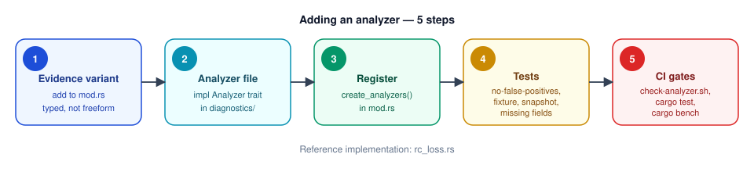
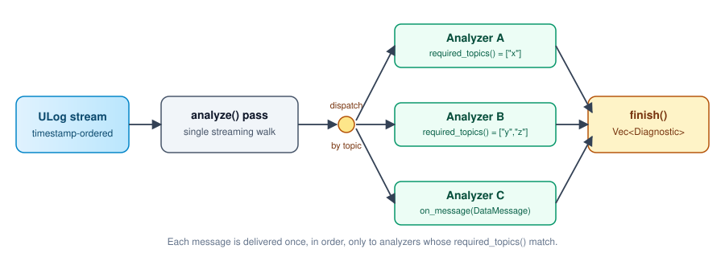

# Adding a diagnostic analyzer

This guide walks through adding a new analyzer to the diagnostics pipeline. The pipeline is defined in [`mod.rs`](./mod.rs) and runs during the streaming `analyze()` pass: each analyzer declares the ULog topics it needs, receives messages one at a time, and emits structured `Diagnostic` results at the end.

If you're new to the module, read [`rc_loss.rs`](./rc_loss.rs) first — it's the shortest complete reference implementation.



## What the pipeline looks like



Key properties to keep in mind when designing an analyzer:

- **Single-pass, streaming.** Messages arrive in file order, not necessarily timestamp order. Handle stale/duplicate samples within a source and gaps explicitly. You don't get a random-access view of the whole log.
- **One log at a time.** There is no batch/training phase. If your detector needs prior data (e.g. a trained model), it has to be baked into the binary as a constant, loaded from disk at startup, or derived from the current log's early samples before you start emitting results.
- **Topic- and instance-scoped dispatch.** The factory wraps each analyzer core in `PerInstance`, isolating ULog `multi_id` state. Primary `vehicle_status` is associated by timestamp: newer status updates are deferred until measurements reach that time or the log ends. The last 128 status samples are retained; armed-only measurements older than retained history are conservatively omitted. A core receives only its source's measurements. Nonzero instances are included in `anchor.instance`; omitted means instance zero. Do not bypass the factory in production.
- **Performance budget.** The whole diagnostic pass has a 500ms budget enforced by `cargo bench` in CI. A ~4MB log currently runs in ~37ms end-to-end. Stay cheap per message.

## Step 1: Add an `Evidence` variant

Every analyzer emits typed, structured evidence — not freeform strings or maps. Changing an existing variant's fields is a breaking schema change, so pick field names carefully the first time.

Edit [`mod.rs`](./mod.rs) and add your variant:

```rust
pub enum Evidence {
    // ... existing variants ...
    ZAxisVibrationAnomaly {
        score: f32,
        peak_accel_m_s2: f32,
        window_start_us: u64,
        window_end_us: u64,
    },
}
```

Also bump `ANALYSIS_VERSION` in the same file when behavior or evidence changes. That tells the reprocessing pipeline historical logs need a re-scan.

## Step 2: Create the analyzer

Each analyzer is a flat `.rs` file in the `diagnostics/` directory:

```
diagnostics/
├── mod.rs                  # Core types, trait, factory
├── testing.rs              # Test utilities (MessageBuilder, etc.)
├── your_analyzer.rs        # ← your analyzer
├── battery_brownout.rs
├── ekf_failure.rs
└── ...
```

Create `crates/converter/src/diagnostics/your_analyzer.rs`:

```rust
//! Short description of what this analyzer detects and how.
//!
//! Topics consumed, thresholds used, and any known limitations or fixture gaps
//! (use SKIP_FIXTURE: <reason> if no real-world log exists yet).

use super::{
    parse_field, AnomalyKind, Analyzer, Diagnostic, Evidence, FieldUnit,
    OutputDescriptor, PlotAnchor, Severity,
};
use px4_ulog::stream_parser::model::DataMessage;

const SOME_THRESHOLD: f32 = 2.5;

pub struct YourAnalyzer {
    detections: Vec<Diagnostic>,
}

impl Default for YourAnalyzer {
    fn default() -> Self { Self::new() }
}

impl YourAnalyzer {
    pub fn new() -> Self {
        Self { detections: Vec::new() }
    }
}

impl Analyzer for YourAnalyzer {
    fn id(&self) -> &str { "your_analyzer" }

    fn description(&self) -> &str { "One-line human description" }

    fn required_topics(&self) -> &[&str] {
        &["sensor_combined", "vehicle_status"]
    }

    fn on_message(&mut self, data: &DataMessage) {
        let topic = data.flattened_format.message_name.as_str();
        let ts = data
            .flattened_format
            .timestamp_field
            .as_ref()
            .map(|tf| tf.parse_timestamp(data.data))
            .unwrap_or(0);

        match topic {
            "sensor_combined" => {
                let Some(az) = parse_field::<f32>(data, "accelerometer_m_s2[2]") else {
                    return;
                };
                // ... detect anomaly, emit Diagnostic ...
                if az > SOME_THRESHOLD {
                    self.detections.push(Diagnostic {
                        id: "your_analyzer".to_string(),
                        summary: format!("Z-axis vibration {az:.1} m/s² at {:.1}s", ts as f64 / 1e6),
                        severity: Severity::Warning,
                        kind: AnomalyKind::Point,
                        timestamp_us: ts,
                        anchor: PlotAnchor::new("sensor_combined", "accelerometer_m_s2[2]"),
                        descriptor: self.output_descriptor(),
                        evidence: Evidence::ZAxisVibrationAnomaly {
                            score: az,
                            peak_accel_m_s2: az,
                            window_start_us: ts,
                            window_end_us: ts,
                        },
                    });
                }
            }
            _ => {}
        }
    }

    fn finish(self: Box<Self>) -> Vec<Diagnostic> {
        self.detections
    }

    fn output_descriptor(&self) -> OutputDescriptor {
        OutputDescriptor::new()
            .field("score", FieldUnit::Ratio)
            .field("peak_accel_m_s2", FieldUnit::Meters)  // m/s² — closest typed unit
            .field("window_start_us", FieldUnit::Microseconds)
            .field("window_end_us", FieldUnit::Microseconds)
    }
}
```

### Trait methods

- **`id()`** is the stable machine identifier stored in the database and exposed via the API's `?diagnostic=` filter. Don't change it after release.
- **`required_topics()`** must match the exact ULog topic names. Typos mean your analyzer silently never runs.
- **`on_message()`** must not panic and must handle missing fields gracefully. Use `parse_field::<T>()` and `parse_bool()` for PX4 bool fields (with the historical uint8 fallback). Missing/invalid values are not healthy observations or zero measurements.
- **`finish()`** takes `Box<Self>` (the pipeline owns the analyzers). Move your accumulated detections out and return them.

### Diagnostic fields

- **`kind: AnomalyKind`** — `Point` (single instant) or `Region { end_timestamp_us }` (time window). The end timestamp lives inside the variant — a point can't have one, a region must.
- **`anchor: PlotAnchor`** — the specific `(topic, field)` where the anomaly should be plotted. Motor 4 failing anchors to `("actuator_outputs", "output[4]")`, not just the topic generically. Set at emit time since the analyzer knows the exact field.
- **`descriptor: OutputDescriptor`** — typed field semantics embedded on each diagnostic. Built via the builder API (see below).

### Output descriptor

Every analyzer implements `output_descriptor()` to declare the typed semantics of its evidence fields. This is baked into `metadata.json` alongside the diagnostics at ingest time — no separate API call, no late-binding.

Use the builder API:

```rust
OutputDescriptor::new()
    .field("voltage_v", FieldUnit::Volts)
    .field("current_a", FieldUnit::Amps)
    .field("flight_mode", FieldUnit::Label)
```

Available `FieldUnit` variants:

| Unit | Meaning |
|---|---|
| `Volts` | Voltage |
| `Amps` | Current |
| `Meters` | Distance |
| `Microseconds` | Timestamp or duration in µs |
| `Milliseconds` | Duration in ms |
| `Pwm` | PWM output value |
| `ActuatorOutput` | Driver-specific output command units; not rotor feedback |
| `Ratio` | Dimensionless ratio |
| `Count` | Integer count |
| `Label` | Free-form string (flight mode, innovation name, etc.) |

### Anomaly kind and plot anchor

Each `Diagnostic` carries:

- **`kind: AnomalyKind`** — `Point` (single instant) or `Region { end_timestamp_us }` (time window). The end timestamp lives inside the variant — a point can't have one, a region must.
- **`anchor: PlotAnchor`** — the specific `(topic, field)` where the anomaly should be plotted. Motor 4 failing anchors to `("actuator_outputs", "output[4]")`, not just the topic generically. Set at emit time since the analyzer knows the exact field.

## Step 3: Register it

In [`mod.rs`](./mod.rs), add your analyzer to `create_analyzers()`:

```rust
pub fn create_analyzers() -> Vec<Box<dyn Analyzer>> {
    vec![
        // ... existing ones ...
        Box::new(your_analyzer::YourAnalyzer::new()),
    ]
}
```

And add the `pub mod your_analyzer;` declaration at the top of the file.

Until you do this, nothing in the pipeline will ever construct or call your analyzer. This is the step most first-time contributors miss.

## Step 4: Write the required tests

CI runs [`scripts/ci/check-analyzer.sh`](../../../../scripts/ci/check-analyzer.sh) on every PR touching this directory. It grep-checks your file for a specific test pattern. At minimum you need:

1. **Healthy negative controls** — provide the required topics, real wire types, valid measurements and armed state where applicable. `sample.ulg` is only a smoke test: it is disarmed and lacks battery, GPS, RC, selector and TECS topics.
2. **An independently labeled fixture** — verify actual telemetry and event timestamps before writing the oracle. Positive tests are named `detects_real_*`. If no fixture exists, document `SKIP_FIXTURE: <reason>`. A historical candidate shown to be a false positive must instead have `NEGATIVE_FIXTURE: <reason>` and a `no_false_positives_*fixture` regression. The CI warning records the remaining positive-data gap.
3. **`handles_missing_fields`** — feed it a message with no fields and assert it doesn't panic and emits nothing.
4. **Synthetic detection and lifecycle tests** — use realistic bool/numeric schemas, multiple instances, invalid samples, timestamp boundaries, onset, recovery and end-of-log cases. Add a positive control in `testing/regressions.rs`; descriptor/evidence parity is verified for every analyzer without skipping missing fixtures.
5. **A snapshot test** using `insta::assert_json_snapshot!`. Snapshots lock serialization, not correctness. Inspect the underlying telemetry and justify every update rather than accepting whatever the implementation produces.

Use [`testing/regressions.rs`](./testing/regressions.rs) for schema-realistic positive/negative controls and instance/lifecycle coverage.

## Interpretation and known limits

These detectors are heuristics, not calibrated probabilities or physical root-cause
diagnoses. Empty diagnostics do not certify a healthy flight: a required topic,
validity flag, cell count, usable baseline or adequate sampling may be unavailable.

- `motor_failure` is a legacy ID for an actuator **command** drop to zero. Evidence
  names `motor_index`/`pwm_value` are retained for compatibility but mean output
  channel/natural driver units. We do not infer rotor lock from a fixed 1900 limit.
- `battery_brownout` reports connected-pack voltage below 3.3V per reported cell.
  Battery chemistry/load matter; this does not establish a power-rail brownout.
- `gps_interference` reports quality degradation after a usable-fix baseline.
  It does not establish interference as the cause.
- EKF innovation diagnostics are per estimator, including standby instances;
  consult `estimator_selector_status` to determine which was selected. Unknown
  ratios or gaps longer than one second break sustained-exceedance tracking.
- Selector counter jumps are counted only when their entire observation interval
  fits the ten-second window. Intermediate timing is unknown; average interval
  is null for such batches. Counter resets are not treated as huge switch bursts.
- RC regions describe receiver loss/failsafe flags. Ongoing regions end at the
  last observed RC/vehicle-status timestamp, not an invented recovery time.
- TECS regions stop at observed recovery, unavailable fields or gaps over one
  second, and never claim
  aircraft control loss from a numerical value alone.

Fixture ground truth established during the correctness audit:

| Fixture | Supported oracle |
|---|---|
| `motor_failure.ulg` | No cross-bank “drops”: bank 0 is always zero; bank 1 drops only after disarm |
| `battery_brownout.ulg` | No low-battery finding: all 382 readings report disconnected |
| `gps_interference.ulg` | No degradation finding: all 312 readings have no fix and zero satellites |
| `ekf_selector_whipsaw.ulg` | Real selector counter changes and independently sustained instance-0 innovations |
| `tecs_nonfinite_pitch.ulg` | Integrator first non-finite at 1,029,918,348µs through the last TECS sample |

Positive field data is still needed for motor commands, connected low batteries,
GPS degradation and RC loss. Do not turn the negative fixtures into positive
oracles to satisfy a gate.

## Step 5: Run the same gates CI will

Before opening a PR, run locally:

```sh
# The trait/test/registration checker CI uses
scripts/ci/check-analyzer.sh

# The diagnostic test suite
cargo test -p flight-review --lib diagnostics

# The performance budget
cargo bench -p flight-review --bench convert
```

If `check-analyzer.sh` complains, it will tell you exactly which criteria you missed. If the bench regresses past the budget, profile your `on_message` — the usual culprit is allocating or parsing the same field multiple times per message.

## Common first-time mistakes

- **Defining a new `Analyzer` trait.** There's already one in [`mod.rs`](./mod.rs). Implement it; don't redefine it.
- **Putting the file outside `diagnostics/`.** It has to live in this directory, otherwise the CI checker and the registration factory won't see it.
- **Returning `Option<String>` or a freeform summary.** Results must be `Vec<Diagnostic>` with a typed `Evidence` variant.
- **Assuming you get the whole log at once.** You don't. Design for streaming.
- **Pulling in heavy ML dependencies without discussing the perf/memory budget first.** The converter is zero-ML today; open an issue before adding something like `extended-isolation-forest`, `smartcore`, etc. so we can agree on how the model is trained, shipped, and benchmarked.
- **Skipping the real-world fixture.** Synthetic tests alone don't count toward the CI gate. Either ship a fixture or mark `SKIP_FIXTURE` with a reason.
- **Using free-form strings for field metadata.** Use `FieldUnit` typed descriptors. No `"unit": "V"` strings — use `FieldUnit::Volts`.

## Questions

Open a draft PR early and tag `@mrpollo`. Draft PRs are the right place to get architecture feedback before you go deep on implementation.
